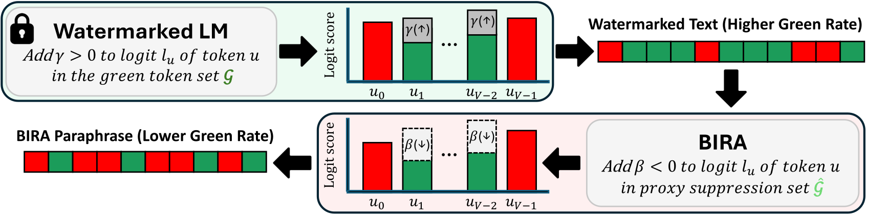

# BIRA: LLM Watermark Evasion via Bias Inversion

Official code for the paper **"LLM Watermark Evasion via Bias Inversion"** (ICML 2026).

[](https://arxiv.org/abs/2509.23019)

<p align="center">
  
</p>

## TL;DR

**BIRA** (Bias Inversion Rewriting Attack) is a simple yet effective watermark evasion method,
motivated by a theoretical analysis of rewriting attacks:

1. Reducing the sampling probability of "green" tokens by a small margin leads to an
   **exponential drop in detection probability**.
2. Building on this, BIRA applies a **negative bias to high-surprisal tokens** — those more likely
   to carry watermark signals — during rewriting, using an **adaptive bias** to mitigate
   distribution distortion.

BIRA achieves state-of-the-art evasion rates (**>99%**) across diverse watermarking schemes,
while preserving the semantic meaning of the original text.

---

## Installation

```bash
conda create -n bira python=3.10 -y
conda activate bira
pip install -r requirements.txt
```

Notes:
- A CUDA-capable GPU is required for the local (`hf`) backend and for watermarked-text generation.
- The `api` backend needs an OpenAI key: `export OPENAI_API_KEY=...`.

---

## Watermarking schemes

The default evaluation set is **7 schemes**: `SIR KGW Unigram UPV EWD DIP EXP`.
Configs for additional schemes (SWEET, Unbiased, TS, SynthID, EXPGumbel, …) are
under [`config/`](config/). The watermark implementations are reused from MarkLLM.

---

## Quickstart

All scripts are run from the repository root and operate over the 7 default watermark schemes.

### Step 1 — Generate watermarked text

```bash
bash scripts/generate_watermarked_text.sh
```

Writes `./watermarked_dataset/<scheme>_response.json` — the input the attacks try to strip.

The watermarked text is produced by a generator LLM, set by `model_path` in
`scripts/generate_watermarked_text.sh` (default `facebook/opt-1.3b`). To watermark with a
different model, change that line to any HuggingFace causal-LM id, e.g.:

```bash
# scripts/generate_watermarked_text.sh
model_path="facebook/opt-1.3b"
```

### Step 2 — Run an attack

A single entry point rewrites the watermarked text, **detects** the watermark on the rewritten
text, and **computes the detectability metrics** (TPR-at-fixed-FPR and best-threshold F1) — all in one pass.

```bash
bash scripts/run_attack.sh <attack> [backend]
```

- `attack ∈ {BIRA, vanilla_paraphrasing, dipper-1, dipper-2, SIRA}` (default: `BIRA`)
- `backend ∈ {hf, api}` — only used by BIRA / vanilla_paraphrasing (default: `hf`)
  - `hf`  = local model (Llama-3.1-8B-Instruct)
  - `api` = OpenAI `gpt-4o-mini`

```bash
bash scripts/run_attack.sh BIRA hf                 # BIRA, local Llama-3.1-8B-Instruct
bash scripts/run_attack.sh BIRA api                # BIRA, gpt-4o-mini
bash scripts/run_attack.sh vanilla_paraphrasing    # no-mask single-pass paraphrase baseline
bash scripts/run_attack.sh dipper-2                # DIPPER paraphraser baseline
bash scripts/run_attack.sh SIRA                    # Self-Information Rewrite Attack baseline
```

Results are written to `./experimental_results/<attack>/<model>/<watermark>/`: the attacked text +
detection scores, and — in the same pass — every detectability metric, embedded in that same
attack-result JSON under a `"detectability"` field (e.g. `tpr_target_fpr_0.01`, `tpr_target_fpr_0.1`,
`f1_best`). The rules / FPRs to evaluate are set by `rules` and `target_fprs` in
`scripts/run_attack.sh` (defaults: `target_fpr` at `0.01` and `0.1`, plus `best`).

> **Recommended `beta`** (BIRA logit bias): `-4.0` for Llama-3.1-8B/70B (`hf`), `-11.0` for
> `gpt-4o-mini` (`api`). These are pre-set in `scripts/run_attack.sh`.

#### Choosing the rewriter model

The rewriter (the model that paraphrases the watermarked text) is selected by a YAML config
passed via `--model_cfg_path`. The default is `model_config/llama3.1-8b.yaml`
(`meta-llama/Meta-Llama-3.1-8B-Instruct`).

To use a different rewriter, add your own config: copy the default YAML, change the `name:` field
to any HuggingFace model id (other fields control sampling/precision, e.g. `top_k`,
`top_p`, `sampling_temp`), then point the `hf` line in `scripts/run_attack.sh` at it:

```bash
# scripts/run_attack.sh
hf)  extra_args+=(--model_cfg_path ./model_config/your_model.yaml --use_sampling); beta=-4.0 ;;
```

Re-tune `beta` when you switch models — the optimal bias is model-dependent.

> For the `api` backend the rewriter is the OpenAI model (`--api_model_name`, e.g. `gpt4o-mini`),
> and `--model_cfg_path` instead points to the **local auxiliary model** used to compute the
> self-information mask (default `model_config/llama3.2-3b.yaml`).

#### Determining the initial logit bias `beta` (β₀) per model

To initialize the logit bias `beta`, we generate 50 paraphrases from the C4 dataset and
gradually decrease `beta` (e.g., from `-1` down to `-12`) until degeneration appears in at
least one of the 50 outputs. We use this value as the initial logit bias **β₀**: it makes
the attack as strong as possible while minimizing the risk of degeneration. During the
attack, `beta` is then adaptively relaxed per sample whenever an output degenerates.

```bash
bash scripts/calibrate_beta.sh hf     # sweeps beta on 50 C4 paraphrases (Llama-3.1-8B-Instruct)
bash scripts/calibrate_beta.sh api    # gpt-4o-mini
```

It prints a per-`beta` degeneration table and the recommended β₀ (the first `beta`, scanning
from `-1` downward, at which at least one of the 50 outputs degenerates), and saves the sweep
to `./beta_calibration/`. Plug the recommended β₀ into `scripts/run_attack.sh`. (Point
`calibrate_beta.sh` at the same `--model_cfg_path` you use for the attack; degeneration is
model-dependent, not watermark-dependent)

> **Note.** The recommended β₀ may differ by a step or two across environments — e.g. a local run
> might suggest `-3` near the paper's `-4` for Llama-3.1-8B. β₀ sets the starting attack strength:
> a larger `|β|` removes the watermark more aggressively but can cost text quality, so it is picked
> near the degeneration onset to balance the two (and then relaxed adaptively per sample). The
> values pre-set in `scripts/run_attack.sh` (`-4.0` hf, `-11.0` api) are the paper's.

### Step 3 — Evaluate

```bash
bash scripts/eval_text_quality.sh <attack> [backend]   # text quality: nli / self_bleu / s-bert / ppl
bash scripts/eval_text_TPR.sh     <attack> [backend]   # re-sweep detectability (TPR@FPRs / best-F1) without re-running the attack
```

Pass the **same `<attack> [backend]`** you used in Step 2 (e.g. `eval_text_quality.sh BIRA api`,
`eval_text_quality.sh SIRA`) so the evaluators read the exact files the attack wrote.

The attack run (Step 2) already emits the detectability metrics; `eval_text_TPR.sh` is only for
re-sweeping the rules / target FPRs (set by `rules` and `target_fprs` in the script) on the
already-saved scores — it recomputes the `"detectability"` block in place, in the same attack-result JSON.

---

## Query-free Attacks

| Name | Description |
|------|-------------|
| `BIRA` | **Ours.** Identifies a high-surprisal proxy suppression set via self-information, then applies a negative logit bias (`beta`) to steer the rewriter away from those tokens. Iteratively relaxes `beta` if the output degenerates. |
| `vanilla_paraphrasing` | No-mask, single-pass paraphrase baseline. |
| `dipper-1`, `dipper-2` | DIPPER paraphraser baselines (different lexical/order diversity). |
| `SIRA` | Self-Information Rewrite Attack: per-sample 3 stages (paraphrase → self-information blanking → attack-fill). |

Adding a new attack is one subclass of `WatermarkRemovalAttack` in
[`attack_utils/attacks.py`](attack_utils/attacks.py) plus an `ATTACK_REGISTRY` entry; all
attacks share the same harness (loop schemes → rewrite → detect → save → TPR).

---

## Single-text example

To run a watermark-removal attack on your own given text:

```bash
# Pass text inline (one or more, each quoted) ...
python examples/attack_example.py --attack BIRA --text "Your text here." "Another text."

# ... or from a file with one text per line:
python examples/attack_example.py --attack BIRA --input_file my_texts.txt
```

The `--input_file` is a plain `.txt` with **one text per line** (blank lines are ignored), e.g.:

```
The discovery of the new exoplanet has excited astronomers around the world. ...
Researchers plan to study its atmosphere with next-generation telescopes. ...
```

It loads the attack's model(s) once and calls `rewrite()` — the exact per-sample attack the
full pipeline runs — then prints the original vs. attacked text.

---

## Citation

```bibtex
@article{hwang2025llm,
  title={LLM Watermark Evasion via Bias Inversion},
  author={Hwang, Jeongyeon and Park, Sangdon and Ok, Jungseul},
  journal={arXiv preprint arXiv:2509.23019},
  year={2025}
}
```

---

## Acknowledgements

This project builds on the
[**Self-Information Rewrite Attack (SIRA)**](https://github.com/Allencheng97/Self-information-Rewrite-Attack)
codebase, which itself is built on [**MarkLLM**](https://github.com/THU-BPM/MarkLLM)
(THU-BPM, Apache-2.0). We reuse their watermarking and evaluation infrastructure, and include
SIRA as a baseline. We thank the authors of both projects.

## License

BIRA is released under the **Apache License 2.0** (see [`LICENSE`](LICENSE)). It incorporates
code from [MarkLLM](https://github.com/THU-BPM/MarkLLM) (Apache-2.0) and the
[SIRA](https://github.com/Allencheng97/Self-information-Rewrite-Attack) baseline (MIT); the
original copyright and license notices of both are retained — see [`NOTICE`](NOTICE).
